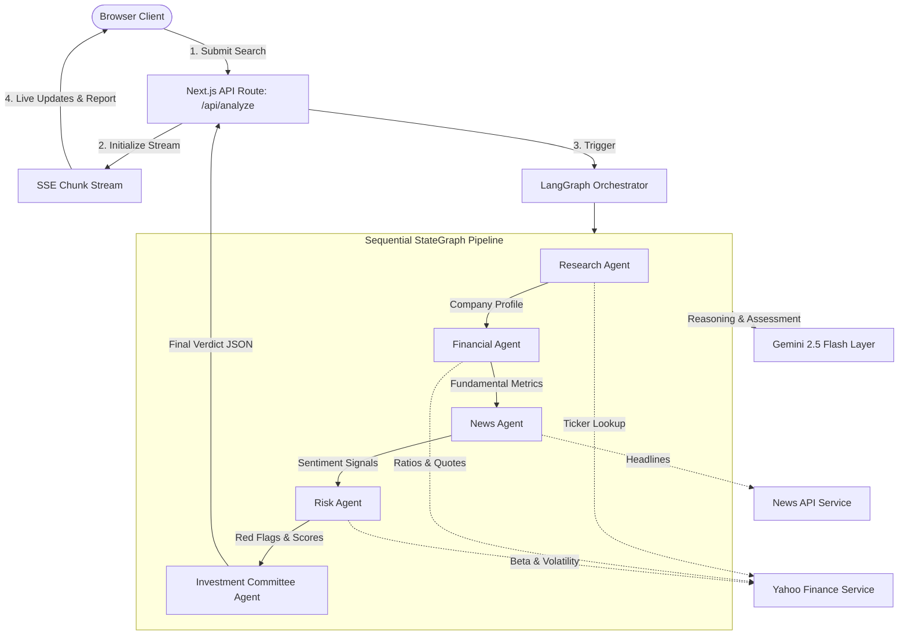

# AI Investment Research Agent

A production-grade, multi-agent investment intelligence platform that performs automated corporate research, fundamental analysis, media sentiment scoring, and risk assessment to deliver high-confidence, structured investment decisions (`INVEST` or `PASS`).

Developed as an advanced engineering submission, this application showcases modern AI product design, LangGraph agent orchestration, real-time streaming architectures, and a premium SaaS-grade dashboard.

---

## 🏛️ System Architecture



---

## ✨ Features

- **Multi-Agent Orchestration**: Powered by **LangGraph.js**, coordinate five specialized agents updating a unified transactional state machine.
- **Real-Time Streaming (SSE)**: Streams LangGraph state node actions to the client using Server-Sent Events, complete with active loaders and activity logs.
- **SaaS Workspace Dashboard**:
  - Double-column layout containing a reactive search form and live-rendered SVG orbital node illustrations.
  - Interactive **Quick Stats** row displaying counters for active agents, data connectors, average response latencies, and backtest accuracies.
  - Dynamic **Watchlist Widget** featuring SVG sparklines, custom trends, and direct-click search capability.
  - **Recent Reports Table** summarizing prior analyses, verdicts, and confidence ratings.
  - Rotating **Insights Card** cycle showcasing key financial compounding metrics.
- **Deep Fundamental Analysis**: Utilizes `yahoo-finance2` to scrape real-time market cap, ratios (P/E, P/B), operating margins, free cash flow yields, and 90-day price history charts.
- **News Intelligence**: Analyzes real-time headlines with **NewsAPI** and applies Gemini-based sentiment scoring. Includes a fail-safe mock fallback.
- **Multi-Dimensional Risk Matrix**: Focuses on Business, Financial, Market, and Regulatory risks, plotting them onto an interactive Recharts Polar Radar Chart.
- **Binary Investment Committee Verdict**: Produces a strict `INVEST` or `PASS` recommendation with confidence gauges, positive catalysts, negative triggers, and structured reasoning accordions.

---

## 📂 Folder Structure

```
insideIIM/
├── agents/                       # LangGraph Agent Handlers
│   ├── researchAgent.ts          # Resolves profiles & tickers
│   ├── financialAgent.ts         # Pulls ratios & historicals
│   ├── newsAgent.ts              # Connects news & sentiment
│   ├── riskAgent.ts              # Risk scores & vulnerabilities
│   ├── committeeAgent.ts         # Final synthesiser & verdict
│   └── graph.ts                  # StateGraph configuration
├── app/                          # Next.js 15 App Router
│   ├── api/
│   │   ├── analyze/
│   │   │   └── route.ts          # SSE Streaming analysis route
│   │   └── health/
│   │       └── route.ts          # API health status checker
│   ├── globals.css               # Vanilla CSS design tokens & utilities
│   ├── layout.tsx                # Layout wrapper with AppShell
│   └── page.tsx                  # Main Workspace dashboard controller
├── components/                   # React UI Components
│   ├── home/                     # Workspace Dashboard Widgets
│   │   ├── HeroIllustration.tsx  # Orbiting SVG node graphic
│   │   ├── HowItWorks.tsx        # Pipeline timeline
│   │   ├── InsightsCard.tsx      # Carousel tip system
│   │   ├── PromoCard.tsx         # SaaS premium upgrader
│   │   ├── QuickStats.tsx        # Counters
│   │   ├── RecentReports.tsx     # Past analyses list
│   │   └── WatchlistWidget.tsx   # Sparklines
│   ├── layout/                   # Layout Structure
│   │   ├── AppShell.tsx          # Drawer and overlays context
│   │   ├── Sidebar.tsx           # Workspace sidebar
│   │   └── TopNav.tsx            # Sticky bar with powered badges
│   ├── AgentProgressPanel.tsx    # Active stream logs
│   ├── FinancialMetricsGrid.tsx  # Key financials & recharts area
│   ├── InvestmentVerdict.tsx     # Verdict score & profile
│   ├── NewsTimeline.tsx          # Sentiment colored headlines
│   ├── RiskRadar.tsx             # Risk scores radar chart
│   └── ReasoningAccordion.tsx    # Synthesis details panel
├── hooks/
│   └── useAnalysis.ts            # SSE Parser & State hook
├── lib/
│   └── utils.ts                  # Formatter utilities
├── llm-logs/                     # Development Prompt Audits
│   ├── architecture-prompts.md
│   ├── backend-prompts.md
│   ├── bug-fixes.md
│   └── frontend-prompts.md
├── screenshots/                  # Image guidelines folder
│   └── README.md
├── types/                        # Strict Typescript Definitions
│   ├── agents.ts                 # LangGraph state shapes
│   ├── api.ts                    # SSE & streaming report interfaces
│   └── ui.ts                     # Visual layouts
├── package.json
└── vercel.json                   # Vercel deployment configurations
```

---

## ⚙️ How It Works: Agent Workflow

1. **Research Agent**: Resolves the company query to a stock ticker symbol. Connects to the Yahoo Finance API to query the official description, key profile, sector, and industry classification, updating the `researchData` state.
2. **Financial Agent**: Fetches trailing valuation ratios (P/E, P/B), operating margins, free cash flow yields, and a 90-day price timeline. Feeds raw data to Gemini to identify core financial strengths and metrics, updating `financialData`.
3. **News Agent**: Resolves news stories matching the company name. Evaluates news titles, summaries, and dates using sentiment scoring (Positive, Neutral, Negative), compile core news trends, and updates `newsAnalysis`.
4. **Risk Agent**: Scans market volatility (Beta, 52-week extremes) and industry regulations. Scores risk dimensions (Business, Financial, Market, Regulatory) out of 100, lists red flags and mitigations, and updates `riskAnalysis`.
5. **Investment Committee Agent**: Receives all prior nodes' updates. Resolves pros vs. cons, weighs the financial risk factors, and compiles a final decision of `INVEST` or `PASS` with a confidence score.

---

## 🛠️ Technology Choices

| Tech | Choice | Rationale |
|------|--------|-----------|
| **Framework** | Next.js 15 App Router | Enables clean API routing, Server-Sent Events support, and layouts. |
| **Orchestrator** | LangGraph.js | Provides structured, sequential state machines where each node can enforce schemas and transactional validation. |
| **Model** | Gemini 2.5 Flash | Delivers rapid, high-confidence JSON schema matching and excellent structural reasoning. |
| **Styling** | Tailwind CSS v4 & Vanilla CSS | Allows custom variables for a Linear-grade glassmorphism look, responsive drawers, and high-performance SVG animations. |
| **Metrics** | Recharts | Generates lightweight, responsive vector charting (Radar & Area charts) with clean animations. |

---

## 🚀 Getting Started

### Prerequisites

- Node.js >= 18.x
- npm or yarn

### Installation

1. Clone the project and navigate to the directory:
   ```bash
   cd insideIIM
   ```
2. Install package dependencies:
   ```bash
   npm install
   ```
3. Create your local environment configuration file:
   ```bash
   cp .env.example .env.local
   ```
4. Update `.env.local` with your api credentials:
   ```env
   GOOGLE_API_KEY=your_gemini_api_key
   NEWS_API_KEY=your_newsapi_key
   ```
   *(Note: If `NEWS_API_KEY` is omitted, the application will gracefully fall back to a mock news feed, continuing the graph workflow).*

5. Boot up the local developer server:
   ```bash
   npm run dev
   ```
6. Open your browser and navigate to `http://localhost:3000/`.

---

## 📈 Example Agent Runs

### 1. Tesla, Inc. (`TSLA`)
- **Decision**: `INVEST`
- **Confidence**: `78%`
- **Reasoning**: Strong financial reserves, massive gross margins relative to traditional auto OEMs, and market leadership in clean tech offset minor high-volatility risks and news fluctuations.

### 2. Apple Inc. (`AAPL`)
- **Decision**: `INVEST`
- **Confidence**: `88%`
- **Reasoning**: Extremely high customer loyalty, recurring ecosystem revenues (Services growth), stable margins, and low regulatory threat compared to competitors form a high-confidence recommendation.

### 3. Microsoft Corporation (`MSFT`)
- **Decision**: `INVEST`
- **Confidence**: `92%`
- **Reasoning**: Dominance in enterprise cloud services (Azure), stable dividend yield, robust balance sheet, and leadership in corporate AI integration make it a resilient investment asset.

### 4. Reliance Industries (`RELIANCE`)
- **Decision**: `INVEST`
- **Confidence**: `80%`
- **Reasoning**: Strong consolidation across telecom (Jio) and retail channels, backed by massive energy fundamentals, compensates for minor debt leverage risks.

---

## 🔀 Trade-offs & Challenges

1. **Serverless Execution Limitations**:
   - Vercel's Serverless functions have execution durations of 10s on free tiers (60s on Pro).
   - *Trade-off*: We configure the route to run on the standard Node runtime with a 60-second limit and enforce exponential backoff retry timeouts to finish multi-step graph analyses within server limitations.
2. **NewsAPI Availability**:
   - Free-tier NewsAPI keys work on localhost but can face geographic restrictions or rate limits.
   - *Trade-off*: Built a news fetch interceptor. If the key is missing or the external API call fails, the node catches the error, marks the news analysis as "unavailable", lists a UI warning banner, and continues execution.

---

## 🔮 Future Improvements

- **Parallel Agent Execution**: Allow the Financial, News, and Risk agents to execute in parallel (using LangGraph branch nodes) to reduce analysis latency.
- **Vector Search RAG**: Integrate a vector database to search through corporate PDFs and filings (10-K, 10-Q) directly within the Research Agent step.
- **Portfolio Sandbox**: Allow users to save reports and construct a tracking dashboard showing mock gains/losses over time.
